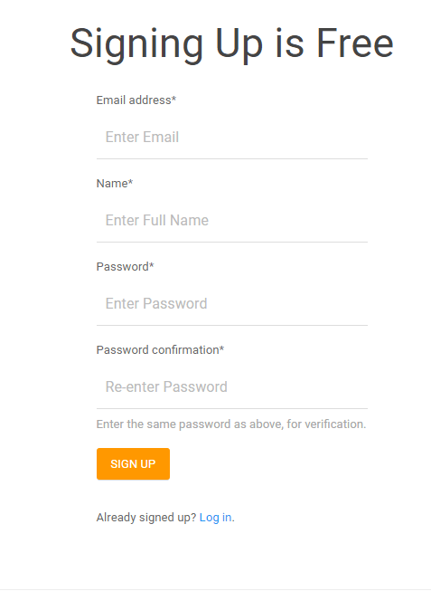

# PyNote
A simple note taking app made with Django 1.10.6

##### Note:
I committed this to Github in its final stages. I have been working on it for almost the entire month of July, but I did not upload it because I thought I would instead turn it into a note website. However, I reconsidered the practicality of this, and instead decided to upload the project to Github as an open-source project for anyone to use, contribute to, and enjoy.

## What is Pynote?

PyNote is a simple note taking Django project. It was developed as a hands-on project
for me to increase my experience with more complex Django concepts, as well as
the MTV framework.

## Features of PyNote - keep a Note

*   Customize notes using the markdown editor. You don't need to know markdown, the editor will help you.
*   Rename, save, update, delete notes, and add tags to them for better organization.
*   Support for code blocks and highlighting.
*   Fully responsive. Use any device, once the website is published, and the site will always find the best layout.

## Things I like about Django.

*   Lots and lots of quality packages
*   Full featured web framework
*   Great community support and excellent documentation
*   Really good ORM. It was really easy to work with databases, such as SQL.
*   You can very quickly make a functional web app when you want to test your ideas.

## Things I Learned

*   Working with a MTV
*   Django's more complex functions and features
*   Integrating different packages into a single project
*   Database operations on a RDBMS

## Resources/packages used

*   [django-crispy-forms](http://django-crispy-forms.readthedocs.io/en/latest/): it makes your forms way more beautiful
*   [virtualenv](https://virtualenv.pypa.io/en/stable/): Allows a nice environment, hence virtual environment, for you to contain and test your site with the proper modules.
*   [django-pagedown](https://github.com/timmyomahony/django-pagedown): Provides an easy editor for markdown input.
*   Many other packages are used, for them do check the requirement file. [link](https://github.com/PranavEranki/PyNote/blob/master/requirements.txt):

## How to run the project locally

### Download
Download the zip by going to the 'Clone or Download' green button in the middle-right of the page.
Once you locate this button, click it once, and two options will appear. Click the bottom right link, which
says 'Download ZIP'. This will download the zip into your computer. Then, move the zip to a directory of your choice
### OR
Clone this repository by going to the directory of your choice where you want this to be installed, then execute this line in the terminal:
`git clone https://github.com/PranavEranki/PyNote.git`

Now, once you have done this, go to the project's folder. Go 1 folder deeper into the project, so you see the requirements.txt file. Then, install the dependencies by simply typing
`pip install -r requirements.txt`
into your command line

### Execution
Now that you have the project downloaded, go into the PyNote folder inside the project.
Once you do this, in the listing of the directory, you should see 4 folders, labeled 'PyNote', 'accounts', 'notes', and 'profiles', along with a python file 'manage.py'.
Run this command in you terminal to start the app:
`python manage.py runserver`
You should see a few statements, where the second is the date and the last statement says 'Quit the server with...'
If you do not see these, and instead get an error, you are probably using a later version of Django. I am using 1.10.6 for this project(Yes, this is slightly outdated, but I am more comfortable with it when constructing apps with Django.) Make sure to install the correct modules and dependencies using the command specified above. Once this is done, and you get no errors when running the server, visit `127.0.0.1:8000` on your web browser and don't forget to give me some feedback.
If you encounter other errors, please bring up an issue on the repo site. I will gladly look into it.

## Screenshots
### Home

### About

### Signup/Login

### Notes

### Profile

## License [MIT](https://github.com/PranavEranki/PyNote/blob/master/LICENSE)
